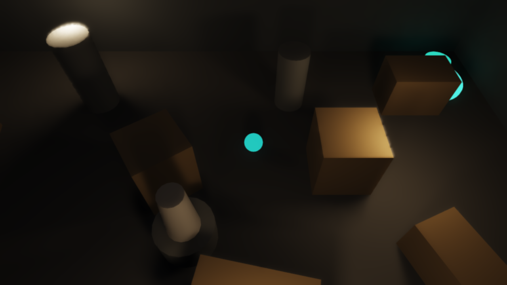

# Shadow Heist — ray traced stealth

A small browser stealth game that shows off **[three-realtime-rt](https://github.com/GoldwinXS/three-realtime-rt)**,
a "turn on ray tracing" library for three.js. You are a glowing-trimmed orb
burglar crossing a dark museum vault. Three guard lights sweep the room, casting
real ray traced soft shadows behind every crate, pillar, and statue. Slip
through the moving pools of warm light, hide in the dark, and reach the glowing
vault exit in the far corner without being seen. The lighting is not baked and
it is not a rasterized fake — every frame the guard lights are re-traced and
your orb casts a live, moving ray traced shadow.



## Controls

- **WASD** or **arrow keys** — move
- Stay out of the guard lights. If a light has line of sight to you, the
  **detection meter** rises (faster the closer the light). Fill it and you are
  caught and sent back to the start.
- Reach the glowing teal **vault exit** in the far corner to win. Your time and
  attempt count are shown; your best time is saved locally.

## How the ray tracing is used

Everything visual in the game is driven by `three-realtime-rt`. The scene is
ordinary three.js — boxes, cylinders, `MeshStandardMaterial`, `PointLight`s —
wrapped in a `RealtimeRaytracer` that owns all lighting:

- **Moving guard lights (`rt.updateLights`).** The three patrol lights are
  repositioned every frame (a sweeping arc, a ping-pong line, an orbit around
  the central statue). A single `rt.updateLights(scene)` re-reads them, so the
  soft-shadow pools slide across the floor and props in real time. `rtRadius`
  on each light controls its soft-shadow penumbra.
- **The player's dynamic shadow (`rt.updateDynamic`).** The player orb is
  registered as a dynamic mesh (`compileScene(scene, { dynamicMeshes: [player] })`).
  Each frame after moving it, `rt.updateDynamic()` refits it into the BVH so the
  orb casts a correct, moving ray traced shadow — no shadow maps.
- **Global illumination + emissive light.** The room is deliberately dark; a dim
  fill light plus one-bounce GI keeps shadow areas readable, and the exit
  beacon's `emissive` material glows *and* lights the floor around it via GI.
- **The detection mechanic reuses the renderer's own idea.** Being "seen" is a
  shadow-ray test: each frame a `THREE.Raycaster` is cast from the orb to each
  guard light against the level's occluders — exactly the visibility question
  the ray tracer answers for shadows. If the ray reaches a light unobstructed
  and in range, you are lit and the meter climbs.

Lighting is traced at half resolution and reconstructed with temporal
denoising + TAA, so the moody look runs in real time in a plain WebGL2 browser.

## Local development

```bash
npm install
npm run dev        # http://localhost:8116
```

Then build and preview the production bundle:

```bash
npm run build
npm run preview    # http://localhost:4173
```

## Live demo

**Play it: https://goldwinxs.github.io/shadow-heist/**

## Credits

Built with [three-realtime-rt](https://github.com/GoldwinXS/three-realtime-rt) —
ray traced lighting for three.js.

## License

MIT © 2026 Goldwin Stewart. See [LICENSE](LICENSE).
